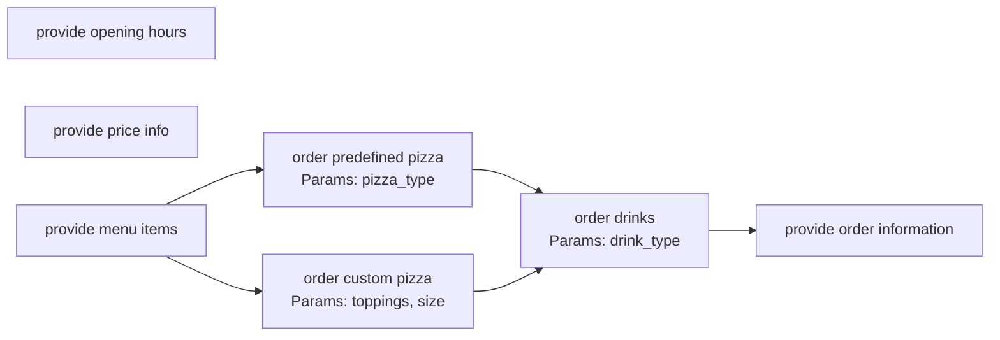
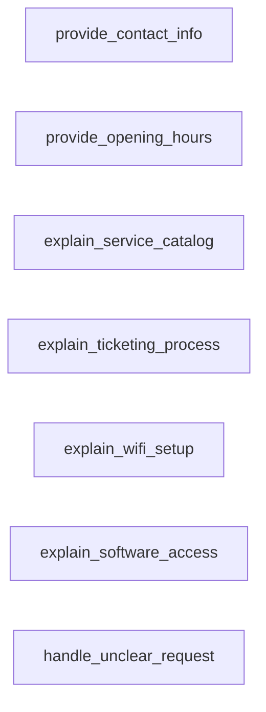

# Chatbot Explorer

Project for my Master's Thesis.

A framework for automated exploration, analysis, and workflow modeling of conversational agents.

## 1. Overview & Goals

Chatbot Explorer is a tool designed to automatically interact with and analyze target chatbots. It uses Large Language Models (LLMs) to conduct multiple conversational sessions, identify the chatbot's core functionalities, limitations, and interaction flows, and generate structured outputs for testing and analysis.

The primary goal is to understand _how_ a user interacts with the chatbot sequentially, not just _what_ the chatbot can do in isolation.

**Key Goals:**

- **Automated Discovery:** Automatically interact with a chatbot to discover its features, capabilities, and limitations.
- **Functionality Extraction:** Identify and structure the distinct actions or tasks the chatbot can perform.
- **Workflow Modeling:** Model the user's journey through the chatbot as a directed graph, capturing sequential dependencies, branching logic, and optional steps. **Crucially, adapt the modeling approach based on whether the chatbot is primarily transactional or informational.**
- **Profile Generation:** Generate standardized YAML user profiles based on discovered functionalities and workflows, suitable for automated testing frameworks.
- **Reporting:** Produce comprehensive reports detailing discovered functionalities (in structured and graphical formats), limitations, supported languages, and fallback behavior.

## 2. Core Functionality

The system follows a multi-phase approach implemented via a LangGraph structure:

1. **Chatbot Interaction:** Connect to and converse with target chatbots (initially Taskyto, Ada-UAM) via provided connectors.
2. **Exploration Sessions:** Conduct multiple, potentially guided, conversational sessions (`explorer_node`) to probe different aspects of the chatbot. This includes logic to handle repetitive failures and ensure the configured number of sessions are attempted.
3. **Functionality Analysis (LLM-based):** Analyze conversation transcripts (`analyzer_node`) using an LLM to identify:
   - Actionable functionalities (what the chatbot _does_) or informational topics (what the chatbot _knows_).
   - Parameters required for each functionality.
   - Observed limitations or failures.
   - Primary language(s) supported and fallback behavior
4. **Workflow Structure Inference (LLM-based):** Analyze the complete set of discovered functionalities and conversation flows (`structure_builder_node`) to determine dependencies and build a graph structure representing the user journey. **This step now includes classifying the chatbot type (transactional vs. informational) and using conditional logic to infer the structure appropriately.**
5. **Profile Generation (LLM-based):** Generate diverse user profiles (roles, goals, context) based on the structured workflow (`goal_generator_node`, `conversation_params_node`, `profile_builder_node`), suitable for testing the chatbot's capabilities.
6. **YAML Validation & Correction:** Validate generated YAML profiles against a schema and attempt LLM-based correction if errors are found (`profile_validator_node`).
7. **Output Generation:**
   - Save validated YAML profiles to disk.
   - Generate a text report (`report.txt`).
   - Generate a visual workflow graph (`workflow_graph.png`) using Graphviz.

## 3. Architecture: LangGraph Flow

The system operates in two main phases: Exploration (managed by `main.py`) followed by Analysis & Profile Generation (orchestrated by LangGraph).

### Phase 1: Exploration (in `main.py`)

- The `main.py` script controls the overall exploration process.
- It calls `run_exploration_session` repeatedly (up to the specified number of sessions).
- **`run_exploration_session`:**
  - Conducts **one** conversational session between an LLM-driven "Explorer AI" and the target chatbot.
  - Can either explore generally or focus on a specific known functionality (`current_node`).
  - Uses a detailed system prompt to guide the Explorer AI, including logic for handling choices, informational responses, and repetitive failures.
  - Calls `extract_functionality_nodes` to identify new functionalities discovered _during that specific session_.
  - Updates the overall state: adds new unique nodes to the `pending_nodes` queue and `root_nodes` list, and marks explored nodes.
  - Returns the session transcript and updated node lists/sets.
- After all sessions are complete, `main.py` gathers the full `conversation_history` and the final list/structure of `discovered_functionalities` (represented as dictionaries). This collected data forms the input `analysis_state` for the next phase.

### Phase 2: Analysis & Profile Generation (LangGraph)

The core analysis and profile generation logic is orchestrated using LangGraph, starting with the results from the exploration phase:

```bash
[Entry: analysis_state from main.py] → structure_builder_node → goal_generator_node → conversation_params_node → profile_builder_node → profile_validator_node → [Finish]

```

- `structure_builder_node`: **Classifies the chatbot type (transactional/informational).** Based on the type, uses specific LLM prompts and logic to analyze all discovered functionalities and conversation snippets, inferring parent/child relationships (or lack thereof) and consolidating duplicate root nodes. Outputs the final structured graph representation (as a list of root dictionaries with children represented by name) and a map of all nodes.
- `goal_generator_node`: Analyzes the final structured functionalities to generate high-level profile goals.
- `conversation_params_node`: Generates specific conversational parameters based on the inferred workflow and goals.
- `profile_builder_node`: Builds structured YAML profiles incorporating workflow steps and parameters.
- `profile_validator_node`: Validates the generated YAML profile against a schema and attempts corrections.

## 4. Key Feature: Workflow Graph Generation

A critical output is the `workflow_graph.png`, representing the user's interaction flow. The system must move beyond a simple flat list of discovered functionalities and represent the _sequence_ and _dependencies_ (or lack thereof) of user interactions, **adapting its approach based on the chatbot type.**

**Requirements:**

- **Graph Representation:** The output must represent the user workflow as a directed graph. Nodes represent functionalities or interaction steps, and edges represent the flow between them.
- **Handling Different Chatbot Types:**
  - **Classification:** Before structuring (`structure_builder_node`), the system classifies the chatbot as primarily "transactional" (workflow-driven) or "informational" (Q&A style) based on conversation patterns and discovered functionalities.
  - **Conditional Structuring:**
    - For **transactional** bots, the structuring logic actively looks for sequences, branches, and joins, assuming a workflow exists. It uses an LLM prompt optimized for finding dependencies.
    - For **informational** bots, the structuring logic defaults to creating independent root nodes for each topic, only creating links if conversational evidence for dependency is explicit and consistent. It uses an LLM prompt optimized for identifying independent topics. This avoids forcing artificial hierarchies.
- **Sequential Dependencies (Transactional):** The graph must accurately capture prerequisites (e.g., edge from A to B if B requires A).
- **Branching Logic (Transactional):** Clearly show points where the conversation can diverge (e.g., one parent leading to multiple mutually exclusive children).
- **Joining Paths (Transactional):** Represent points where diverged paths converge back to a common step.
- **Independent Topics (Informational):** Represent distinct informational capabilities as separate root nodes with no incoming edges, reflecting their independent nature.
- **Root Nodes:** Identify the valid starting points (entry points) for workflows or topics.
- **LLM Inference:** The structuring relies on LLM analysis of functionalities and conversation flow, guided by the appropriate prompt (transactional or informational) based on the classification.
- **Root Node Consolidation:** Includes a step within `structure_builder_node` to merge or link root nodes that are identified by an LLM as semantically similar entry points, cleaning up potential duplicates.
- **Visualization:** The generated `workflow_graph.png` should clearly visualize the inferred structure using nodes and directed edges via Graphviz.

**Example Desired Flow (Transactional - Pizza Bot):**

The goal is to capture flows like this: A user starts, sees menu items. This action (`list_pizza_options`) leads to selecting a type (`select_pizza_type`), then size (`select_pizza_size`), then potentially adding drinks (`order_drinks`), and finally confirming (`confirm_order`).



**Example Desired Flow (Informational - Ada-UAM Bot):**

For an informational bot, the goal is to represent the different topics the user can inquire about independently. There are typically no required sequences between these topics. The structuring logic should default to creating separate root nodes.



> Note: The Mermaid diagrams above are illustrative of the desired logical flow. The actual implementation uses Graphviz.

## 5. Usage

```bash
python src/main.py [-h] [-s SESSIONS] [-n TURNS] [-t TECHNOLOGY] [-u URL] [-m MODEL] [-o OUTPUT]
```

### Arguments

All arguments are optional.

- `-s, --sessions`: Number of exploration sessions (default: 3).
- `-n, --turns`: Maximum turns per session (default: 8).
- `-t, --technology`: Chatbot technology connector to use (default: `taskyto`). See available technologies below.
- `-u, --url`: Chatbot URL (default: `http://localhost:5000`). Only necessary for technologies like `taskyto` that require an explicit endpoint. Others may have the URL embedded in their connector.
- `-m, --model`: OpenAI model for analysis and generation (default: `gpt-4o-mini`).
- `-o, --output`: Output directory for generated files (default: `output`).

### Supported Chatbot Technologies

- `taskyto`: Custom chatbot framework (requires self-hosting and initialization).
- `ada-uam`: MillionBot instance for Universidad Autónoma de Madrid (UAM).

## 6. Input/Output

- **Input:**
  - Command-line arguments (see Usage).
  - Target chatbot accessible via its connector/URL.
- **Output (in the specified `--output` directory, organized by technology):**
  - Multiple `.yaml` files (one per generated user profile).
  - `report.txt` (structured text report summarizing findings).
  - `workflow_graph.png` (visual graph representation of the interaction flow).

### Example Command

```bash
python src/main.py -t ada-uam -s 5 -n 10 -o generated_profiles/ada-uam
```

This command runs 5 exploration sessions with a maximum of 10 turns each, targeting the `ada-uam` chatbot, and saves the output to `generated_profiles/ada-uam`.

## 7. Technology Stack

- Python 3.11+
- LangChain / LangGraph (Core framework for LLM interaction and workflow orchestration)
- OpenAI API (LLM provider)
- Graphviz (Python library and system tool for graph visualization)
- PyYAML (YAML parsing and generation)
- Requests (HTTP requests, used in some connectors)
