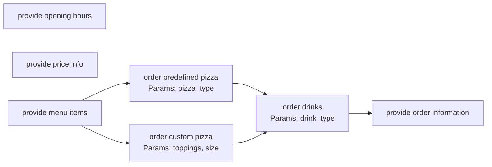

# Chatbot Explorer

Project for my Master's Thesis.

A framework for automated exploration, analysis, and workflow modeling of conversational agents.

## 1. Overview & Goals

Chatbot Explorer is a tool designed to automatically interact with and analyze target chatbots. It uses Large Language Models (LLMs) to conduct multiple conversational sessions, identify the chatbot's core functionalities, limitations, and interaction flows, and generate structured outputs for testing and analysis.

The primary goal is to understand _how_ a user interacts with the chatbot sequentially, not just _what_ the chatbot can do in isolation.

**Key Goals:**

- **Automated Discovery:** Automatically interact with a chatbot to discover its features, capabilities, and limitations.
- **Functionality Extraction:** Identify and structure the distinct actions or tasks the chatbot can perform.
- **Workflow Modeling:** Model the user's journey through the chatbot as a directed graph, capturing sequential dependencies, branching logic, and optional steps.
- **Profile Generation:** Generate standardized YAML user profiles based on discovered functionalities and workflows, suitable for automated testing frameworks.
- **Reporting:** Produce comprehensive reports detailing discovered functionalities (in structured and graphical formats), limitations, supported languages, and fallback behavior.

## 2. Core Functionality

The system follows a multi-phase approach implemented via a LangGraph structure:

1. **Chatbot Interaction:** Connect to and converse with target chatbots (initially Taskyto, Ada-UAM) via provided connectors.
2. **Exploration Sessions:** Conduct multiple, potentially guided, conversational sessions (`explorer_node`) to probe different aspects of the chatbot.
3. **Functionality Analysis (LLM-based):** Analyze conversation transcripts (`analyzer_node`) using an LLM to identify:
   - Actionable functionalities (what the chatbot _does_).
   - Parameters required for each functionality.
   - Observed limitations or failures.
   - Primary language(s) supported and fallback behavior.
4. **Workflow Structure Inference (LLM-based):** Analyze the complete set of discovered functionalities and conversation flows (`goal_generator_node`, `conversation_params_node`) to determine sequential dependencies and build a graph structure representing the user journey.
5. **Profile Generation (LLM-based):** Generate diverse user profiles (roles, goals, context) based on the structured workflow (`profile_builder_node`), suitable for testing the chatbot's capabilities.
6. **YAML Validation & Correction:** Validate generated YAML profiles against a schema and attempt LLM-based correction if errors are found (`profile_validator_node`).
7. **Output Generation:**
   - Save validated YAML profiles to disk.
   - Generate a text report (`report.txt`).
   - Generate a visual workflow graph (`workflow_graph.png`) using Graphviz.

## 3. Architecture: LangGraph Flow

The core logic is orchestrated using LangGraph:

```bash
[Entry] → explorer_node → analyzer_node → goal_generator_node → conversation_params_node → profile_builder_node → profile_validator_node → [Finish]
```

- `explorer_node`: Conducts conversations with the target chatbot.
- `analyzer_node`: Processes conversation data to extract features, limitations, language, and fallback behavior.
- `goal_generator_node`: Analyzes functionalities and conversation flows to infer workflow structure and generate high-level profile goals.
- `conversation_params_node`: Generates specific conversational parameters based on the inferred workflow and goals.
- `profile_builder_node`: Builds structured YAML profiles incorporating workflow steps and parameters.
- `profile_validator_node`: Validates the generated YAML profile against a schema and attempts corrections.

## 4. Key Feature: Workflow Graph Generation

A critical output is the `workflow_graph.png`, representing the user's interaction flow. The system must move beyond a simple flat list of discovered functionalities and represent the _sequence_ and _dependencies_ of user interactions.

**Requirements:**

- **Graph Representation:** The output must represent the user workflow as a directed graph (ideally a Directed Acyclic Graph - DAG, though cycles might occur in some chatbot logic). Nodes represent functionalities or interaction steps, and edges represent the flow between them.
- **Sequential Dependencies:** The graph must accurately capture prerequisites. If Functionality B can only be accessed after Functionality A is completed, there should be a directed edge from A to B.
- **Branching Logic:** The graph must clearly show points where the conversation can diverge based on user choice or chatbot logic. For example, after deciding to "Order Pizza", the flow might split into two distinct paths: "Order Predefined Pizza" and "Order Custom Pizza". This should be visualized as a single parent node leading to multiple mutually exclusive child nodes or paths.
- **Joining Paths:** The graph must represent points where previously diverged conversational paths converge back into a common flow. Following the pizza example, after either ordering a predefined pizza or creating a custom one, both paths might lead to adding drinks (`order_drinks`). This convergence should be clearly visualized.
- **Optional Steps:** Steps that are not mandatory within a specific path should be identifiable. For instance, "Add Drinks" might be an optional step after the main pizza order is confirmed but before finalizing the order. This could be indicated visually (e.g., dashed lines, node styling) or through node attributes in the underlying data.
- **Root Nodes:** Identify the valid starting points (entry points) of a conversation or workflow.
- **LLM Inference:** The structuring of this graph relies heavily on LLM analysis of both the extracted functionalities _and_ the flow observed in the conversation transcripts. The LLM needs to be prompted specifically to identify sequential dependencies, branching points, convergence points, and optional steps based on the conversational context and functionality descriptions (like parent/child relationships if available).
- **Visualization:** The generated `workflow_graph.png` should clearly and aesthetically visualize this structure using nodes and directed edges via Graphviz.

**Example Desired Flow (Pizza Bot):**

The goal is to capture flows like this: A user starts, decides to order pizza. This action (`provide_menu_items`) leads to a choice: order a predefined pizza (`order_predefined_pizza`) or create a custom one (`order_custom_pizza`). After completing either pizza path, the flow can proceed to adding drinks (`order_drinks`). Finally, the flow proceeds to getting order confirmation/information (`provide_order_information`). Other functionalities like checking opening hours might be separate entry points.



> Note: The Mermaid diagram above is illustrative of the desired logical flow. The actual implementation uses Graphviz based on LLM-inferred relationships from conversation analysis.

## 5. Usage

```bash
python src/main.py [-h] [-s SESSIONS] [-n TURNS] [-t TECHNOLOGY] [-u URL] [-m MODEL] [-o OUTPUT]
```

### Arguments

All arguments are optional.

- `-s, --sessions`: Number of exploration sessions (default: 3).
- `-n, --turns`: Maximum turns per session (default: 8).
- `-t, --technology`: Chatbot technology connector to use (default: `taskyto`). See available technologies below.
- `-u, --url`: Chatbot URL (default: `http://localhost:5000`). Only necessary for technologies like `taskyto` that require an explicit endpoint. Others may have the URL embedded in their connector.
- `-m, --model`: OpenAI model for analysis and generation (default: `gpt-4o-mini`).
- `-o, --output`: Output directory for generated files (default: `output`).

### Supported Chatbot Technologies

- `taskyto`: Custom chatbot framework (requires self-hosting and initialization).
- `ada-uam`: MillionBot instance for Universidad Autónoma de Madrid (UAM).

## 6. Input/Output

- **Input:**
  - Command-line arguments (see Usage).
  - Target chatbot accessible via its connector/URL.
- **Output (in the specified `--output` directory, organized by technology):**
  - Multiple `.yaml` files (one per generated user profile).
  - `report.txt` (structured text report summarizing findings).
  - `workflow_graph.png` (visual graph representation of the interaction flow).

### Example Command

```bash
python src/main.py -t ada-uam -s 5 -n 10 -o generated_profiles/ada-uam
```

This command runs 5 exploration sessions with a maximum of 10 turns each, targeting the `ada-uam` chatbot, and saves the output to `generated_profiles/ada-uam`.

## 7. Technology Stack

- Python 3.11+
- LangChain / LangGraph (Core framework for LLM interaction and workflow orchestration)
- OpenAI API (LLM provider)
- Graphviz (Python library and system tool for graph visualization)
- PyYAML (YAML parsing and generation)
- Requests (HTTP requests, used in some connectors)
