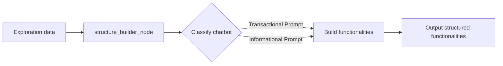
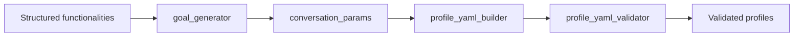
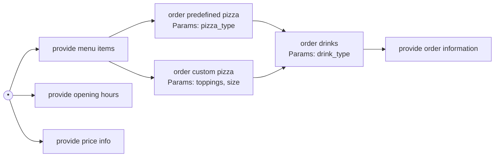
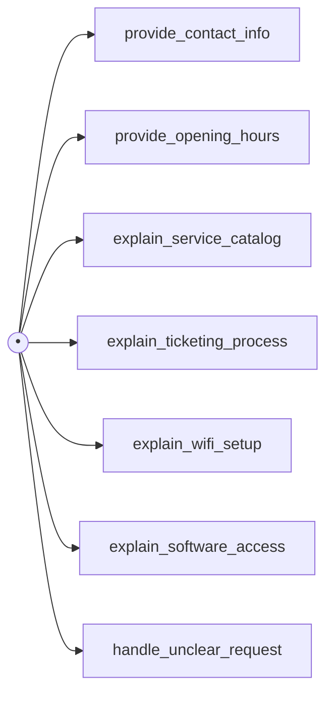

# Chatbot Explorer

Project for my Master's Thesis.

A framework for automated exploration, analysis, and workflow modeling of conversational agents.

## 1. Overview & Goals

Chatbot Explorer is a tool designed to automatically interact with and analyze target chatbots. It uses Large Language Models (LLMs) to conduct multiple conversational sessions, identify the chatbot's core functionalities, limitations, and interaction flows, and generate structured outputs for testing and analysis.

The primary goal is to understand _how_ a user interacts with the chatbot sequentially, not just _what_ the chatbot can do in isolation.

**Key Goals:**

- **Automated Discovery:** Automatically interact with a chatbot to discover its features, capabilities, and limitations.
- **Functionality Extraction:** Identify and structure the distinct actions or tasks the chatbot can perform.
- **Workflow Modeling:** Model the user's journey through the chatbot as a directed graph, capturing sequential dependencies, branching logic, and optional steps, adapt the modeling approach based on whether the chatbot is primarily transactional or informational.
- **Profile Generation:** Generate standardized YAML user profiles based on discovered functionalities and workflows, suitable for [Sensei](https://github.com/satori-chatbots/user-simulator).
- **Reporting:** Produce comprehensive reports detailing discovered functionalities (in structured and graphical formats), limitations, supported languages, and fallback behavior.

## 2. Core Functionality

The system follows a multi-phase approach implemented via a LangGraph structure:

1. **Chatbot Interaction:** Connect to and converse with target chatbots (initially Taskyto, Ada-UAM) via provided connectors.
2. **Session Preparation:** Before starting the conversations the chatbot's language and fallback message are found by sending a few confusing messages.
3. **Exploration Sessions:**
   1. Conduct multiple conversational sessions to probe different aspects of the chatbot.
   2. If a fallback is received during the conversation, the LLM will rephrase the sentence and if it is received again, the topic will be changed.
   3. After each conversation the LLM tries to extract functionalities so that they can be further explored on the next sessions.
4. **Bot Classification:** After running all the sessions, the conversations and the found functionalities are passed to an LLM which will determine if the chatbot is transactional or informative.
   - **Transactional:** chatbots that allow you to perform actions, such as booking a flight or ordering food.
   - **Informational:** chatbots that provide information, such as answering questions or providing customer support.
   - The detected chatbot type is stored in the application state for use in subsequent processing steps.
5. **Functionality Analysis (LLM-based):** Depending on the chatbot's type a different prompt will be used, but in this section the LLM will receive conversations and functionalities and will try to merge functionalities that are the same, maybe find new ones, and find relationships between them. The output will be a structured representation of the discovered functionalities, including parent/child relationships and unique root nodes.
   - **Transactional:** The LLM will look for sequential dependencies, branching logic, and optional steps.
   - **Informational:** The LLM will look for independent topics and create separate root nodes for each topic.
6. **Profile Generation (LLM-based):** After the functionalities have been found and a workflow is created, the LLM will proceed to create the profiles for Sensei taking into account the discovered things. It is in done in different sections where different prompts will be creating the goals, context, parameters and so on.
7. **YAML Validation & Correction:** Validate generated YAML profiles with a script and if any error is found, pass it to the LLM to try to correct it.
8. **Output Generation:**

- Save validated YAML profiles to disk.
- Generate a text report (`report.txt`).
- Generate a visual workflow graph (`workflow_graph.png`) using Graphviz.

## 3. Architecture: LangGraph Flow

The system operates in two main phases: Exploration (managed by `main.py`) followed by Analysis & Profile Generation (LangGraph).

### Phase 1: Exploration (in `main.py`)

- The `main.py` script controls the overall exploration process.
- It starts by detecting the chatbot's language and fallback message.
- It calls `run_exploration_session` repeatedly to conduct multiple sessions.
- **`run_exploration_session`:**
  - Conducts a conversation session with the target chatbot.
  - Can explore general capabilities or focus on a specific functionality.
  - Handles fallbacks by rephrasing queries and changing topics if needed.
  - Extracts new functionalities from each conversation.
  - Updates the discovery state (pending_nodes, root_nodes, explored_nodes).
- After all sessions, `main.py` collects all conversation history and discovered functionalities for analysis.

### Phase 2: Analysis & Profile Generation (Multiple LangGraphs)

The system uses specialized graphs for different stages of analysis:

#### 1. Structure Analysis Graph



- Determines if the chatbot is transaction or information
- Uses different structuring strategies based on chatbot classification:
  - **Transactional:** Actively seeks dependencies, branches, and joins
  - **Informational:** Defaults to independent topics, requires strong evidence for relationships
- Builds functionality structure with clear parent/child hierarchies
- Outputs a hierarchical representation of the chatbot's functionality workflow

#### 2. Profile Generation Graph



- Creates user profile goals based on discovered functionality structure
- Generates conversation parameters for each profile
- Builds YAML profiles for the Sensei simulator
- Validates profiles against schema and attempts to fix any validation errors

## 4. Workflow Graph Generation

One of the main outputs of this tool is a visual graph (`workflow_graph.png`) showing how users interact with the chatbot. Although, the primary focus of this tool is to make the profiles, this was added to help visualize the discovered functionalities and their relationships.

As it has been explained above, the system uses different approaches for transactional and informational chatbots.

**Example Desired Flow (Transactional - Pizza Bot):**

The goal is to capture flows like this: A user starts, sees menu items. This action leads to selecting a predefined pizza or customizing one. The user then orders drinks, and then the chatbot confirms the order.



**Example Desired Flow (Informational - Ada-UAM Bot):**

For an informational bot, the goal is to represent the different topics the user can inquire about independently. There are typically no required sequences between these topics. The structuring logic should default to creating separate root nodes.



> Note: The Mermaid diagrams above are illustrative of the desired logical flow. The actual implementation uses Graphviz.

## 5. Usage

```bash
python src/main.py [-h] [-s SESSIONS] [-n TURNS] [-t TECHNOLOGY] [-u URL] [-m MODEL] [-o OUTPUT]
```

### Arguments

All arguments are optional.

- `-s, --sessions`: Number of exploration sessions (default: 3).
- `-n, --turns`: Maximum turns per session (default: 8).
- `-t, --technology`: Chatbot technology connector to use (default: `taskyto`). See available technologies below.
- `-u, --url`: Chatbot URL (default: `http://localhost:5000`). Only necessary for technologies like `taskyto` that require an explicit endpoint. Others may have the URL embedded in their connector.
- `-m, --model`: OpenAI model for analysis and generation (default: `gpt-4o-mini`).
- `-o, --output`: Output directory for generated files (default: `output`).

### Supported Chatbot Technologies

- `taskyto`: Custom chatbot framework (requires self-hosting and initialization).
- `ada-uam`: MillionBot instance for Universidad Autónoma de Madrid (UAM).

## 6. Input/Output

- **Input:**
  - Command-line arguments (see Usage).
  - Target chatbot accessible via its connector/URL.
- **Output (in the specified `--output` directory, organized by technology):**
  - Multiple `.yaml` files (one per generated user profile).
  - `report.txt` (structured text report summarizing findings).
  - `workflow_graph.png` (visual graph representation of the interaction flow).

### Example Command

```bash
python src/main.py -t ada-uam -n 8 -s 12 -o generated_profiles/ada-uam
```

This command runs 12 exploration sessions with a maximum of 8 turns each, targeting the `ada-uam` chatbot, and saves the output to `generated_profiles/ada-uam`.

## 7. Technology Stack

- Python 3.11+
- LangChain / LangGraph (Core framework for LLM interaction and workflow orchestration)
- OpenAI API (LLM provider)
- Graphviz (Python library and system tool for graph visualization)
- PyYAML (YAML parsing and generation)
- Requests (HTTP requests, used in some connectors)
